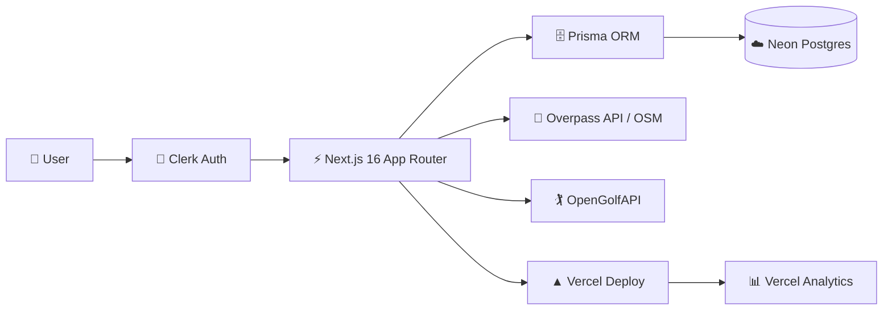

# Golf Core

**Track your handicap, log rounds, and improve your game with World Handicap System (WHS) calculations.**

[](https://golfcore.vercel.app)
[](https://github.com/WLewis0991/GolfCore/actions)
[](https://vercel.com/willsproject/golfcore)
[](LICENSE)

---

## Screenshots

### Landing — Golf Core


*Dark scorecard-inspired landing with a single "Enter" call to action.*

### Add Round — Course Search & Tee Selection


*Course search (OpenGolfAPI), tee selection with rating/slope, date, 9/18-hole toggle, and notes — mobile-first for logging on the course.*

### Dashboard — Handicap Index & Recent Rounds


*Real-time handicap index, recent rounds with differentials, and quick navigation to all features (light theme shown; dark theme also supported).*

---

## Features

- **Handicap Dashboard** — Live index calculation (WHS), trend sparkline, recent rounds with score & differential
- **Round Entry** — Course search (OpenGolfAPI), GPS "Use my location" (Overpass/OSM), tee selection, 9/18-hole toggle, hole-by-hole score grid with par/stroke index
- **Handicap Calculation** — Full WHS engine: Net Double Bogey caps, Course Handicap, Adjusted Gross, Score Differentials, Handicap Index (best 8 of last 20)
- **History & Trends** — Recharts line chart of index over time, date range & course filters, rounds table with index at each date
- **Export** — CSV/JSON download of round history (date, course, tee, score, differential, index)
- **Course Library** — All cached courses with tee ratings/slopes
- **Edit & Delete Rounds** — Full CRUD with server actions & validation
- **Responsive Design** — Mobile-first, works on the course

---

## Architecture



**Data Flow:**
1. User authenticates via **Clerk** (email/password, GitHub, Apple OAuth)
2. **Next.js** (`proxy.ts` middleware) protects dashboard routes
3. Server Actions (`lib/actions/*`) handle mutations with **Zod** validation
4. **Prisma** (via `@prisma/adapter-neon`) talks to **Neon Postgres**
5. Course data lazily cached from **OpenGolfAPI** (tees, holes, ratings) + **Overpass** (nearby GPS search)
6. **Vercel** hosts with automatic deployments on push; **Analytics** tracks usage

---

## Tech Stack

| Layer | Choice |
|-------|--------|
| Framework | Next.js 16 (App Router, Turbopack, PPR) |
| Auth | Clerk (`@clerk/nextjs`) — middleware in `proxy.ts`, `auth()` in Server Actions |
| Database | Prisma 7 + Neon Postgres (`@prisma/adapter-neon`) |
| Validation | Zod (server-only schemas) |
| Charts | Recharts |
| Testing | Vitest (WHS engine), Playwright (E2E with Clerk auth fixtures) |
| CI/CD | GitHub Actions (lint → typecheck → test → build → Playwright) |
| Deploy | Vercel (preview on PR, production on main) |

---

## Getting Started

### Prerequisites
- Node.js 20+
- Clerk account (for auth keys)
- Neon account (for Postgres)

### Environment Variables
Create `.env.local` from `.env.example`:

```bash
cp .env.example .env.local
```

| Variable | Description |
|----------|-------------|
| `NEXT_PUBLIC_CLERK_PUBLISHABLE_KEY` | Clerk publishable key |
| `CLERK_SECRET_KEY` | Clerk secret key |
| `NEXT_PUBLIC_CLERK_SIGN_IN_URL` | `/sign-in` |
| `NEXT_PUBLIC_CLERK_SIGN_UP_URL` | `/sign-up` |
| `NEXT_PUBLIC_CLERK_SIGN_IN_FALLBACK_REDIRECT_URL` | `/dashboard` |
| `NEXT_PUBLIC_CLERK_SIGN_UP_FALLBACK_REDIRECT_URL` | `/dashboard` |
| `DATABASE_URL` | Neon pooled connection string |
| `DATABASE_URL_UNPOOLED` | Neon direct connection (for migrations) |
| `SEED_USER_ID` | Your Clerk user ID (for seeding) |

### Install & Run
```bash
# Install dependencies
npm install

# Generate Prisma client
npm run postinstall
# or: npx prisma generate

# Push schema to Neon (or run migrations)
npx prisma db push

# Optional: seed sample course & round
npx tsx prisma/seed.ts

# Start dev server
npm run dev
```

Open http://localhost:3000

---

## WHS Handicap Math

The handicap engine (`lib/handicap/`) is a pure TypeScript module — no framework, no DB — fully unit-tested (80 tests, Vitest).

### Calculation Steps

1. **Net Double Bogey (NDB) per hole**
   ```
   strokesReceived = (hole.strokeIndex ≤ courseHandicap) ? 1 : 0
   ndbCap = par + 2 + strokesReceived
   adjustedScore = min(rawScore, ndbCap)
   ```
   Unplayed holes (`null` score) = NDB cap.

2. **Course Handicap**
   ```
   courseHandicap = round(index × slope / 113)
   ```
   *Can be auto-derived from player's index at round date (`calculateIndexAsOf`) or entered manually.*

3. **Adjusted Gross Score**
   Sum of NDB-capped hole scores.

4. **Score Differential**
   ```
   differential = roundToTenth((113 / slope) × (adjustedGross − rating))
   ```

5. **Handicap Index**
   - Sort last 20 rounds by date
   - Take lowest N differentials (per WHS table)
   - Average × 0.96, rounded to 0.1
   - No index until 3 rounds played

| Rounds Played | Differentials Used |
|---------------|-------------------|
| 3–5 | 1 |
| 6–8 | 2 |
| 9–10 | 3 |
| 11–12 | 4 |
| 13–14 | 5 |
| 15–16 | 6 |
| 17 | 7 |
| 18–20 | 8 |
| 21+ | 8 (best 8 of last 20) |

### Design Decisions

- **No User table** — Clerk `userId` stored directly as string FK on `Round`
- **Plus handicaps (negative index)** fully supported
- **PCC excluded** — Playing Conditions Calculation requires association-level data; differentials computed without PCC (standard for unofficial tracking)
- **Both auto & manual Course Handicap** — auto via `calculateIndexAsOf()` from prior rounds, or manual entry; both feed same `roundAdjustedGross()` code
- **Round schema stores** `courseHandicap` (Int) + `courseHandicapSource` (Index \| Manual)

---

## Project Structure

```
golfcore/
├── app/
│   ├── (auth)/           # Sign-in / Sign-up (Clerk)
│   ├── (dashboard)/      # Protected app routes
│   │   ├── dashboard/    # Index + sparkline + recent rounds
│   │   ├── rounds/       # List, new, edit
│   │   ├── history/      # Chart + filters + export
│   │   └── courses/      # Cached course library
│   ├── api/              # Proxy routes (Overpass, OpenGolfAPI)
│   ├── layout.tsx        # Root layout + ClerkProvider + Analytics
│   └── page.tsx          # Landing page
├── components/           # React components (forms, charts, nav)
├── lib/
│   ├── actions/          # Server Actions (Zod + Prisma + revalidatePath)
│   ├── handicap/         # WHS engine (pure TS, 80 tests)
│   ├── prisma.ts         # Prisma singleton
│   └── utils/            # Format, export helpers
├── prisma/
│   ├── schema.prisma     # Course, Tee, TeeHole, Round, HoleScore
│   └── seed.ts           # Fairview Municipal + sample round
├── e2e/                  # Playwright tests (Clerk auth fixture)
└── proxy.ts              # clerkMiddleware (protects all routes)
```

---

## Testing

```bash
# Unit tests (WHS engine)
npm test

# TypeScript check
npm run typecheck

# Lint
npm run lint

# E2E tests (Playwright)
npm run test:e2e
```

CI runs all checks on push/PR (`.github/workflows/playwright.yml`).

---

## Deployment

1. Push to GitHub
2. Import in Vercel → auto-detects Next.js
3. Add env vars (same as `.env.local`)
4. Add deployed URL to Clerk **Allowed Origins** (Development) or configure **Production Domain**
5. Verify sign-in/up → dashboard redirect works

---

## License

MIT
